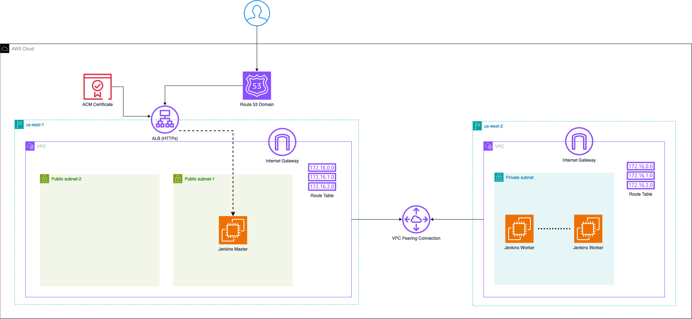

<!-- PROJECT LOGO -->
<br />
<div align="center">
  <a href="https://github.com/e-alancas/jenkins-aws-terraform-ansible">
    
  </a>

  <h3 align="center"></h3>

  <p align="center">
    A project for creating infrastructure for Jenkins using Terraform, AWS and Ansible
    <br />
    <a href="https://github.com/e-alancas/jenkins-aws-terraform-ansible"><strong>Explore the Jenkins automation solution »</strong></a>
    <br />
    <br />
    ·
    <a href="https://github.com/e-alancas/jenkins-aws-terraform-ansible/issues">Report Bug</a>
    ·
    <a href="https://github.com/e-alancas/jenkins-aws-terraform-ansible/issues">Request Feature</a>
  </p>
</div>


<!-- TABLE OF CONTENTS -->
<details>
  <summary>Table of Contents</summary>
  <ol>
    <li>
      <a href="#about-the-project">About The Project</a>
      <ul>
        <li><a href="#built-and-integrated-with">Built and Integrated With </a></li>
      </ul>
    </li>
    <li>
      <a href="#getting-started">Getting Started</a>
      <ul>
        <li><a href="#prerequisites">Prerequisites</a></li>
        <li><a href="#installation">Installation</a></li>
      </ul>
    </li>
    <li><a href="#usage">Usage</a></li>
    <li><a href="#roadmap">Roadmap</a></li>
    <li><a href="#contributing">Contributing</a></li>
    <li><a href="#license">License</a></li>
    <li><a href="#contact">Contact</a></li>
  </ol>
</details>


<!-- ABOUT THE PROJECT -->
## About The Project

This project serves as a guide to create and setup a Jenkins main instance with multiple agents in AWS by automating all infrastructure via Terraform and perform the initial installation of Jenkins using Ansible playbooks.

### Architecture Diagram

<div align="center">
  <a href="https://github.com/e-alancas/jenkins-aws-terraform-ansible">
    
  </a>

</div>

### AWS Services used
* EC2
* VPC
* VPC Peering
* ACM
* Route 53
* ALB

<p align="right">(<a href="#readme-top">back to top</a>)</p>


### Built and Integrated With

* 
* 
* 
* 


<p align="right">(<a href="#readme-top">back to top</a>)</p>

<!-- GETTING STARTED -->
## Getting Started

### Terraform Controller
You will need a Terraform controller which is basically a host to execute the Terraform build cycle. I highly recommend to run this using a Linux AMI2 EC2 instance in your AWS environment. However, this can also be executed from you local PC.

#### EC2 Terraform Controller
Using an EC2 instance as the Terraform controller requires some permissions configurations so it can have access to perform the desired actions using the pre-installed AWS CLI. In the ```resources/iam-policies/``` folder you can find some IAM Policies that can be attached to a role for the instance. I highly recommend the custom-strict.json one since is more granular and specific.

This is the documentation on how to attach roles to an EC2 instance: https://docs.aws.amazon.com/AWSEC2/latest/UserGuide/iam-roles-for-amazon-ec2.html


#### Localhost Terraform Controller
Using the local host as the Terraform controller will require you to manually install and configure the AWS CLI and attach the required permissions to your personal user. For this, you can leverage the policies located in the ```resources/iam-policies/``` folder.

Useful documentation for setting up the AWS CLI: https://docs.aws.amazon.com/cli/latest/userguide/cli-chap-configure.html

Useful documentation on how to attach policies to users:https://docs.aws.amazon.com/IAM/latest/UserGuide/access_policies_manage-attach-detach.html


### Terraform Controller Prerequisites
The next packages need to be installed in the controller:

* Terraform: >=1.7.5 [Download](https://developer.hashicorp.com/terraform/install)

* Ansible: >= 2.16.4 [Download](https://docs.ansible.com/ansible/latest/installation_guide/intro_installation.html)

### AWS Prerequisites
The backend for this Terraform project will be hosted in S3, so you will need an S3 bucket for this. This name needs to be updated in the ```backend.tf``` file and update the ```bucket``` value.

<p align="right">(<a href="#readme-top">back to top</a>)</p>

## Build resources

* Navigate to ```src/```
* ```$ terraform init```
* ```$ terraform validate```
* ```$ terraform plan```
* ```$ terraform apply```

## Destroy resources

* ```$ terraform destroy```

## Roadmap

- [ ] Create the Ansible playbook for configuring agents

<p align="right">(<a href="#readme-top">back to top</a>)</p>

<!-- LICENSE -->
## License

Distributed under the MIT License. See `LICENSE.txt` for more information.

<p align="right">(<a href="#readme-top">back to top</a>)</p>

<!-- CONTACT -->
## Contact

Eliecer Alan Cascante - [LinkedIn](https://www.linkedin.com/in/eliecer-alan-cascante/) - ealancascante@gmail.com

Project Link: [https://github.com/e-alancas/jenkins-aws-terraform-ansible/issues](https://github.com/e-alancas/selenium-functional-testing/)

<p align="right">(<a href="#readme-top">back to top</a>)</p>